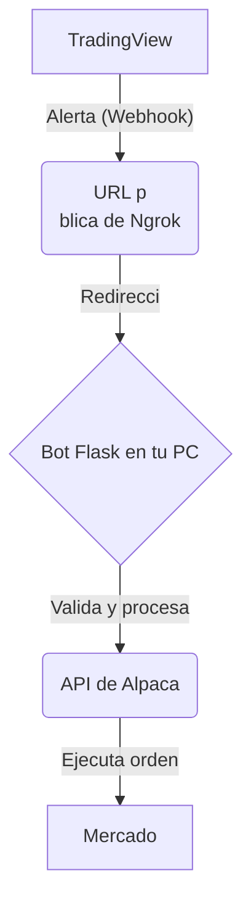

# Bot de Trading: TradingView a Alpaca

Este proyecto es una soluci
 completa y lista para usar que te permite automatizar tus operaciones de trading. Recibe alertas de [TradingView](https://www.tradingview.com/) a trav
es de webhooks y ejecuta 
rdenes de compra o venta directamente en tu cuenta de [Alpaca](https://alpaca.markets/) a trav
es de su API.

La aplicaci
 est
 construida con Python y Flask, e incluye una interfaz web amigable para que puedas configurar tus credenciales de API de forma segura sin necesidad de editar el c
digo.

  <!-- Se a
adir
a una imagen real de la interfaz m
s adelante -->

## 
ndice

1.  [Caracter
sticas Principales](#caracter
sticas-principales)
2.  [C
mo Funciona](#c
mo-funciona)
3.  [Requisitos Previos](#requisitos-previos)
4.  [Gu
a de Instalaci
 y Configuraci
](#gu
a-de-instalaci
-y-configuraci
)
    *   [Paso 1: Preparar el Entorno](#paso-1-preparar-el-entorno)
    *   [Paso 2: Instalar Dependencias](#paso-2-instalar-dependencias)
    *   [Paso 3: Iniciar el Bot](#paso-3-iniciar-el-bot)
    *   [Paso 4: Configurar las API Keys](#paso-4-configurar-las-api-keys)
    *   [Paso 5: Exponer el Bot a Internet con Ngrok](#paso-5-exponer-el-bot-a-internet-con-ngrok)
    *   [Paso 6: Configurar el Webhook en TradingView](#paso-6-configurar-el-webhook-en-tradingview)
5.  [Uso: Creaci
 de Alertas en TradingView](#uso-creaci
-de-alertas-en-tradingview)
6.  [Verificaci
 y Soluci
 de Problemas](#verificaci
-y-soluci
-de-problemas)
7.  [Aviso Legal](#aviso-legal)

## Caracter
sticas Principales

*   **Integraci
 Directa**: Conecta la potencia de las alertas de TradingView con la ejecuci
 de 
rdenes de Alpaca.
*   **Interfaz Web de Configuraci
**: No necesitas tocar el c
digo. Introduce tus API keys de Alpaca y otros par
metros a trav
es de una p
gina web local y segura.
*   **Soporte para Paper y Live Trading**: Cambia f
cilmente entre tu cuenta de pr
ctica (Paper Trading) y tu cuenta real.
*   **Seguridad**: Protege tu endpoint de webhook con un secreto personalizable para evitar alertas no autorizadas.
*   **Tipos de 
rdenes Flexibles**: Soporta 
rdenes de mercado (`market`) y 
rdenes l
mite (`limit`).
*   **Registro de Actividad (Logging)**: Todas las alertas recibidas y las 
rdenes ejecutadas se guardan en un archivo `trading_bot.log` para que puedas revisarlas.
*   **Panel de Estado**: La interfaz web muestra el estado de la conexi
 con Alpaca y los detalles de tu cuenta en tiempo real.

## C
mo Funciona

El sistema sigue un flujo de trabajo sencillo pero robusto:

1.  **TradingView**: Creas una alerta en un gr
fico. Cuando se dispara, env
a un mensaje (webhook) a una URL espec
fica.
2.  **Ngrok**: Como el bot se ejecuta en tu ordenador local, no es accesible desde Internet. Ngrok es una herramienta que crea un t
nel seguro y te da una URL p
blica temporal (`https://....ngrok.io`) que redirige el tr
fico a tu bot local.
3.  **Bot de Trading (Flask)**: El servidor Flask est
 escuchando en tu m
quina. Recibe la alerta enviada por TradingView a trav
es de la URL de Ngrok.
4.  **Procesamiento de la Alerta**: El bot verifica el secreto (si est
 configurado), analiza el contenido del mensaje (acci
, s
mbolo, cantidad) y prepara una orden.
5.  **Alpaca**: Usando las API keys que configuraste, el bot se conecta a tu cuenta de Alpaca y env
a la orden para su ejecuci
.



## Requisitos Previos

Antes de empezar, aseg
rate de tener lo siguiente:

1.  **Python**: Debes tener Python instalado en tu ordenador. Puedes descargarlo desde [python.org](https://www.python.org/downloads/).
2.  **Cuenta de Alpaca**: Una cuenta activa en [Alpaca](https://alpaca.markets/). Puede ser una cuenta de Paper Trading para empezar.
    *   Necesitar
s tu **API Key** y tu **Secret Key**.
3.  **Cuenta de TradingView**: Una cuenta en [TradingView](https://www.tradingview.com/) con un plan que permita webhooks en las alertas (generalmente, cualquier plan de pago).
4.  **Ngrok**: Una cuenta en [Ngrok](https://ngrok.com/) para crear la URL p
blica. El plan gratuito es suficiente.

## Gu
a de Instalaci
 y Configuraci

Sigue estos pasos cuidadosamente. No se requiere experiencia en programaci
.

### Paso 1: Preparar el Entorno

1.  Crea una carpeta en tu ordenador donde guardar
s los archivos del bot. Por ejemplo, `C:\Users\TuUsuario\Desktop\TradingBot`.
2.  Copia los siguientes archivos que te he proporcionado dentro de esa carpeta:
    *   `app.py`
    *   `requirements.txt`
    *   `README.md`
    *   Una carpeta llamada `templates` que contenga el archivo `index.html`.

La estructura de tu carpeta debe verse as
:

```
TradingBot/

├── app.py

├── requirements.txt

├── README.md

└── templates/

    └── index.html
```

### Paso 2: Instalar Dependencias

1.  Abre la terminal o l
nea de comandos de tu sistema:
    *   **Windows**: Busca "cmd" o "PowerShell" en el men
 de inicio.
    *   **Mac**: Busca "Terminal" en tus aplicaciones.
2.  Navega a la carpeta que creaste en el paso anterior. Usa el comando `cd`.

    ```bash
    cd C:\Users\TuUsuario\Desktop\TradingBot
    ```

3.  Instala las librer
as de Python necesarias ejecutando el siguiente comando:

    ```bash
    pip install -r requirements.txt
    ```

    Este comando leer
 el archivo `requirements.txt` e instalar
 Flask y la librer
a de Alpaca autom
ticamente.

### Paso 3: Iniciar el Bot

1.  En la misma terminal, ejecuta el siguiente comando para iniciar el servidor del bot:

    ```bash
    python app.py
    ```

2.  Si todo va bien, ver
s un mensaje como este, indicando que el servidor est
 funcionando:

    ```
    * Serving Flask app 'app'
    * Running on http://127.0.0.1:5000
    ```

3.  
**Importante**: No cierres esta ventana de terminal. Mientras est
 abierta, el bot estar
 activo.

### Paso 4: Configurar las API Keys

1.  Abre tu navegador web (Chrome, Firefox, etc.) y ve a la siguiente direcci
:

    ```
    http://localhost:5000
    ```

2.  Ver
s la interfaz web del bot.
3.  Rellena los campos:
    *   **Alpaca API Key**: Tu clave API de Alpaca.
    *   **Alpaca Secret Key**: Tu clave secreta de Alpaca.
    *   **Usar cuenta Paper Trading**: Marca esta casilla si est
s usando una cuenta de pr
ctica. Desm
rcala para operar con dinero real.
    *   **Secreto del Webhook**: Introduce una contrase
a inventada por ti (ej: `mi_bot_secreto_123`). Es una capa extra de seguridad. An
tala, la necesitar
s m
s tarde.
4.  Haz clic en **Guardar Configuraic
**.

### Paso 5: Exponer el Bot a Internet con Ngrok

1.  Descarga Ngrok desde su [p
gina oficial](https://ngrok.com/download) y descompr
melo.
2.  Abre **una nueva terminal** (deja la del bot abierta) y navega a la carpeta donde est
 el ejecutable de Ngrok.
3.  Ejecuta el siguiente comando para crear un t
nel hacia el puerto 5000 (donde se est
 ejecutando el bot):

    ```bash
    ngrok http 5000
    ```

4.  Ngrok mostrar
 una pantalla con informaci
. Busca la l
nea que dice `Forwarding` y copia la URL que termina en `.ngrok.io`. Deber
a ser algo como `https://xxxxxxxx.ngrok.io`.

    

    **Esta es tu URL p
blica.**

### Paso 6: Configurar el Webhook en TradingView

1.  Ve a [TradingView](https://www.tradingview.com/) y abre el gr
fico del activo que quieres operar.
2.  Crea una nueva alerta (clic derecho en el gr
fico -> "A
adir alerta" o `Alt + A`).
3.  En la configuraci
 de la alerta, ve a la pesta
a **"Notificaciones"**.
4.  Marca la casilla **"URL de Webhook"**.
5.  Pega la URL que obtuviste de Ngrok en el paso anterior y a
ade `/webhook` al final. Por ejemplo:

    ```
    https://xxxxxxxx.ngrok.io/webhook
    ```

6.  En el campo **"Mensaje"**, debes escribir el c
digo JSON que el bot espera. Este es el "lenguaje" que TradingView usar
 para decirle a tu bot qu
 hacer.

## Uso: Creaci
 de Alertas en TradingView

El campo "Mensaje" en la alerta de TradingView es crucial. Debes usar un formato JSON estricto.

#### Formato B
sico

```json
{
  "secret": "tu_secreto_webhook",
  "action": "buy",
  "symbol": "SPY",
  "quantity": "10",
  "order_type": "market"
}
```

| Campo         | Descripci
                                                                   |
|---------------|----------------------------------------------------------------------------------|
| `secret`      | **Opcional**. Tu contrase
a secreta. Debe coincidir con la que pusiste en la interfaz web. |
| `action`      | `"buy"` para comprar o `"sell"` para vender.                                      |
| `symbol`      | El ticker del activo (ej: `"AAPL"`, `"BTC/USD"`, `"EUR/USD"`).                     |
| `quantity`    | La cantidad de acciones o contratos a operar.                                      |
| `order_type`  | `"market"` para una orden a mercado o `"limit"` para una orden l
mite.             |
| `limit_price` | **Requerido si `order_type` es `"limit"`**. El precio al que quieres que se ejecute la orden. |

#### Ejemplo de Orden de Compra a Mercado

Compra 5 acciones de Apple al precio actual del mercado.

```json
{
  "secret": "mi_bot_secreto_123",
  "action": "buy",
  "symbol": "AAPL",
  "quantity": "5",
  "order_type": "market"
}
```

#### Ejemplo de Orden de Venta L
mite

Vende 1 acci
 de Tesla si el precio alcanza los $300.

```json
{
  "secret": "mi_bot_secreto_123",
  "action": "sell",
  "symbol": "TSLA",
  "quantity": "1",
  "order_type": "limit",
  "limit_price": "300"
}
```

Una vez configurada la alerta, haz clic en **"Crear"**. Cuando las condiciones de la alerta se cumplan, TradingView enviar
 el mensaje, Ngrok lo redirigir
, y tu bot ejecutar
 la orden en Alpaca.

## Verificaci
 y Soluci
 de Problemas

*   **Revisa la interfaz web**: La p
gina `http://localhost:5000` tiene una secci
 de "Estado del Bot" que te dice si las credenciales son correctas y si hay conexi
 con Alpaca.
*   **Revisa la terminal del bot**: La ventana de terminal donde ejecutaste `python app.py` mostrar
 informaci
 en tiempo real sobre los webhooks recibidos.
*   **Revisa el archivo de log**: En la misma carpeta del bot, se crear
 un archivo `trading_bot.log`. Abre este archivo de texto para ver un historial detallado de todas las operaciones y posibles errores.
*   **Revisa la terminal de Ngrok**: La terminal de Ngrok te muestra las peticiones HTTP que est
 recibiendo. Si dice `200 OK`, la comunicaci
 entre TradingView y tu bot funciona.

## Aviso Legal

El trading financiero implica un riesgo significativo. Este software se proporciona "tal cual", sin garant
as de ning
n tipo. El autor o los contribuidores no se hacen responsables de ninguna p
erdida financiera sufrida como resultado del uso de esta herramienta. 

**Usa este bot bajo tu propio riesgo.** Se recomienda encarecidamente probarlo exhaustivamente con una cuenta de Paper Trading antes de usarlo con dinero real.
